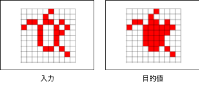

# ネーミング

## ルール

- 入力と目的値がセットになったデータが与えられる



- 入力から目的値を出力する関数（pythonプログラム）を作成する
- 関数の呼び出しから出力までの処理時間を競う

## 提供データ

- function.py
  - 作成用コード
- main.py
  - 実行用コード
- draw.py
  - 結果描写用コード
- train.json
  - 確認用データ

## 試行方法

実行コマンド
```
python main.py
```
出力結果を描写
```
python main.py --draw True
```

## メモ

### コンペ概要

- 与えられた入力から提示された目的値へと変換するコードを作成
- 入力と目的値のペアは複数（10個？）← 最大400個
- 処理時間の短さで評価

#### 参考
- タスク内容: [リンク](https://arcprize.org/play?task=007bbfb7)
- kaggle: [リンク](https://www.kaggle.com/competitions/google-code-golf-2025/overview)

### 開催目的

- **アルゴリズム開発**の経験を積む
- 実装の工夫や最適化スキルを学ぶ
- **参加者同士の知見を共有**

### 実施手順

1. 問題・データセットの配布
2. 参加者は期間内にコード作成（2ヶ月？）
3. 処理時間を計測しランキング化
4. 参加者の実装の工夫や考え方を共有
