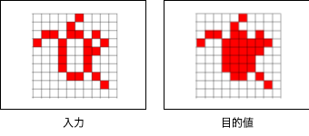

# グループ内コンペ

## ルール

- 入力と目的値がセットになったデータが与えられる



- 入力から目的値を出力する関数（pythonプログラム）を作成する
- 関数の呼び出しから出力までの処理時間を競う
  - 処理時間は1,000回の実行の平均を参照する

## 提供データ

- function.py
  - 作成対象のコード。
- main.py
  - 作成した関数を実行するコード。
- draw.py
  - 結果を描写するコード。
- train.json
  - 入力と目的値のセット(訓練用)。評価は主催者が保有するデータで行います。
- requirements.txt
  - 実行環境の例。

## 試行方法

実行コマンド
```
python main.py
```
出力結果を描写
```
python main.py --draw True
```

#### 参考
- タスク内容: [リンク](https://arcprize.org/play?task=007bbfb7)
- kaggle: [リンク](https://www.kaggle.com/competitions/google-code-golf-2025/overview)

### 開催目的

- **アルゴリズム開発**の経験を積む
- 実装の工夫や最適化スキルを学ぶ
- **参加者同士の知見を共有**


